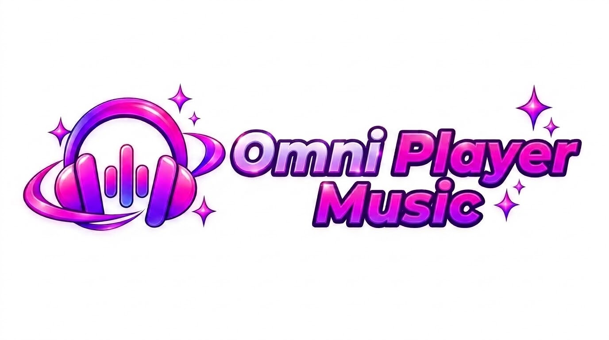
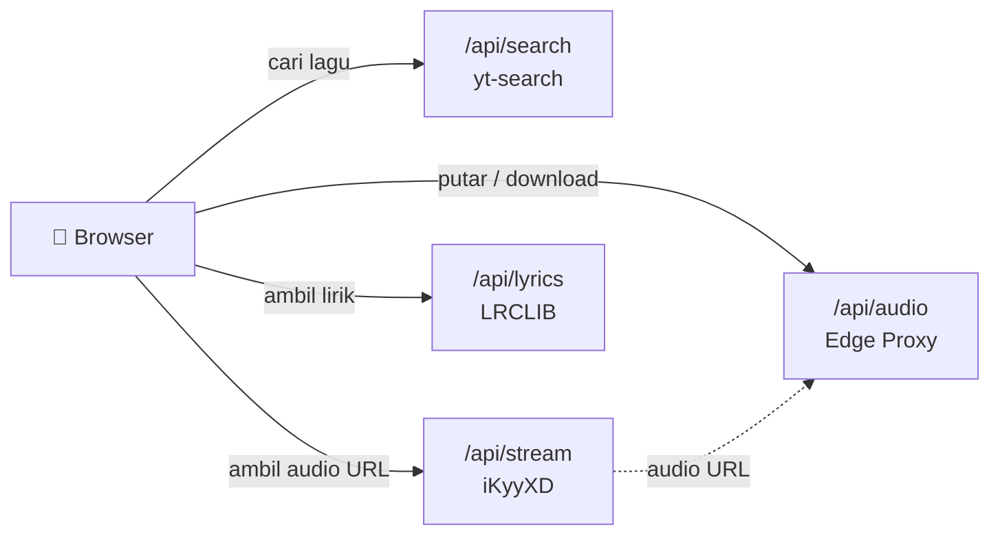

<div align="center">



# 🎧 Omni Player Music

### Streaming, lirik sinkron, dan playlist — langsung di browser.

Gratis · Tanpa iklan · Tanpa login · Tanpa install

<br />

[](https://omniplayermusic.web.id)


[Live Demo](https://omniplayermusic.web.id) · [Laporkan Bug](https://github.com/reinhald90/omni-player-music/issues) · [Request Fitur](https://github.com/reinhald90/omni-player-music/issues)

</div>

---

## 📖 Daftar Isi

- [Tentang](#-tentang)
- [Fitur](#-fitur)
- [Screenshot](#️-screenshot)
- [Tech Stack](#️-tech-stack)
- [Arsitektur](#-arsitektur)
- [Quick Start](#-quick-start)
- [Struktur Project](#-struktur-project)
- [Keyboard Shortcuts](#️-keyboard-shortcuts)
- [Theme Presets](#-theme-presets)
- [API Endpoints](#-api-endpoints)
- [Deploy ke Vercel](#-deploy-ke-vercel)
- [Catatan Penting](#️-catatan-penting)
- [Roadmap](#️-roadmap)
- [Kontribusi](#-kontribusi)
- [Lisensi](#-lisensi)
- [Kredit](#-kredit)
- [Kontak](#-kontak)

---

## 🎯 Tentang

**Omni Player Music** adalah pemutar musik berbasis web dengan tampilan premium ala Apple Music. Cari lagu, putar seketika, baca lirik yang bergerak sinkron, lalu simpan ke koleksi pribadimu — semuanya tanpa akun dan tanpa instalasi.

> Semua data pribadi (favorit, playlist, riwayat, statistik, tema) disimpan **lokal di browser** menggunakan `localStorage`.

---

## ✨ Fitur

### 🎵 Music Player

| Fitur | Keterangan |
|---|---|
| **Streaming instan** | Sumber dari YouTube melalui API iKyyXD |
| **Full Player** | Tampilan ala Apple Music dengan ambient blur background |
| **Visualizer real-time** | Ditenagai Web Audio API |
| **Seek bar** | Progress bar bisa di-drag |
| **Volume control** | Dilengkapi tombol mute |
| **Loop & Shuffle** | Dua mode pemutaran |
| **Auto-next** | Lanjut otomatis dari antrian |

### 🎤 Lirik

- **Lirik sinkron** dari database LRCLIB
- **Auto-scroll** — baris aktif selalu di tengah layar
- **Offset slider** — geser waktu lirik kalau kurang pas
- **Karaoke Mode** — lirik fullscreen dengan efek warna mengisi
- **Fallback pesan seru** kalau lagu tidak punya lirik

### 📚 Koleksi Pribadi

- ❤️ **Favorit** — simpan lagu kesayangan
- 📂 **Playlist** — buat playlist sendiri, tambah/hapus lagu
- 🕘 **History** — riwayat lagu yang pernah diputar
- 🔎 **Recent Search** — riwayat pencarian
- 📊 **Stats** — total lagu diputar, top artist, dan hari aktif

### 🎛️ Kontrol Tambahan

- **Queue Panel** — kelola antrian lagu
- **Sleep Timer** — auto-pause setelah 5 / 15 / 30 / 60 menit
- **Download MP3** — simpan lagu ke perangkat
- **Share Card Generator** — kartu gambar untuk IG Story / WA Status
- **Keyboard Shortcuts** — kontrol penuh lewat keyboard

### 🎨 Kustomisasi & Performa

- **6 Theme Presets** — Pink, Purple, Ocean, Sunset, Emerald, Mono
- **Dark UI** dengan efek glassmorphism
- **Responsive** — HP, tablet, dan desktop
- **PWA ready** — bisa dipasang ke home screen
- **Edge Runtime** untuk proxy audio
- **Auto-fallback** CORS proxy (allorigins)
- **Caching** lewat Next.js & Vercel

---

## 🖼️ Screenshot

<div align="center">

| Home | Full Player | Lirik |
|:---:|:---:|:---:|
|  |  |  |

| Playlist | Stats | Karaoke |
|:---:|:---:|:---:|
|  |  |  |

</div>

> 💡 Screenshot di atas masih placeholder. Ganti dengan tangkapan layar asli setelah deploy.

---

## 🛠️ Tech Stack

| Kategori | Teknologi |
|---|---|
| **Framework** | Next.js 14 (App Router) |
| **Bahasa** | TypeScript 5 |
| **Styling** | Tailwind CSS 3 + custom glassmorphism |
| **State** | Zustand + persist middleware |
| **Icon** | Lucide React |
| **Audio** | Web Audio API + AnalyserNode |
| **Pencarian** | yt-search |
| **Sumber audio** | iKyyXD (`api.ikyyxd.my.id`) |
| **Lirik** | LRCLIB (`lrclib.net`) |
| **Proxy** | Vercel Edge Runtime |
| **Deploy** | Vercel |

---

## 🧩 Arsitektur



Semua request pihak ketiga dilewatkan lewat route internal Next.js, sehingga browser tidak terkena masalah CORS maupun mixed content.

---

## 🚀 Quick Start

### Prasyarat

- Node.js **18.17** atau lebih baru
- npm / pnpm / yarn

### Instalasi

```bash
# Clone repo
git clone https://github.com/reinhald90/omni-player-music.git
cd omni-player-music

# Install dependency
npm install

# Jalankan dev server
npm run dev
```

Buka <http://localhost:3000> di browser.

### Build Production

```bash
npm run build
npm start
```

---

## 📁 Struktur Project

```text
omni-player-music/
├── app/
│   ├── api/
│   │   ├── audio/            # Edge proxy untuk audio streaming
│   │   ├── lyrics/           # Proxy + fallback ke LRCLIB
│   │   ├── search/           # Proxy yt-search
│   │   └── stream/           # Proxy iKyyXD
│   ├── about/                # Halaman tentang
│   ├── channel/              # Halaman saluran WhatsApp
│   ├── favorites/            # Halaman favorit
│   ├── history/              # Halaman riwayat
│   ├── playlists/            # Halaman playlist
│   │   └── [id]/             # Detail playlist
│   ├── stats/                # Halaman statistik
│   ├── globals.css           # Global styles + keyframes
│   ├── layout.tsx            # Root layout
│   └── page.tsx              # Home / Search
├── components/
│   ├── layout/               # Navbar, LoadingScreen, ThemeSwitcher
│   ├── player/               # GlobalPlayer, FullPlayer, Visualizer, Lyrics,
│   │                         # KaraokeMode, QueuePanel, SleepTimerPanel
│   ├── playlist/             # CreatePlaylistModal, AddToPlaylistModal
│   ├── search/               # SearchBar, ResultCard, ResultList
│   └── share/                # ShareCardModal
├── hooks/
│   ├── useAudio.ts
│   └── useKeyboardShortcuts.ts
├── lib/
│   ├── audioAnalyser.ts
│   ├── cardGenerator.ts
│   ├── constants.ts
│   ├── formatter.ts
│   ├── lyrics.ts
│   └── yt-search.d.ts
├── store/                    # Zustand stores
│   ├── playerStore.ts
│   ├── favoritesStore.ts
│   ├── historyStore.ts
│   ├── playlistStore.ts
│   ├── searchHistoryStore.ts
│   ├── statsStore.ts
│   └── themeStore.ts
├── types/
│   └── index.ts
├── public/
│   ├── icon.png
│   ├── logo.png
│   ├── manifest.json
│   └── favicon.ico
├── next.config.js
├── tailwind.config.js
├── postcss.config.js
├── tsconfig.json
├── vercel.json
└── package.json
```

---

## ⌨️ Keyboard Shortcuts

| Tombol | Fungsi |
|:---:|---|
| <kbd>Space</kbd> | Play / Pause |
| <kbd>←</kbd> | Mundur 5 detik |
| <kbd>→</kbd> | Maju 5 detik |
| <kbd>↑</kbd> | Volume naik |
| <kbd>↓</kbd> | Volume turun |
| <kbd>M</kbd> | Mute / Unmute |
| <kbd>N</kbd> | Lagu berikutnya |
| <kbd>P</kbd> | Lagu sebelumnya |
| <kbd>L</kbd> | Toggle loop |
| <kbd>H</kbd> | Buka Full Player |
| <kbd>Esc</kbd> | Tutup Full Player |

---

## 🎨 Theme Presets

| Tema | Warna Utama |
|---|---|
| 🌸 **Pink** (default) | `#ff2d55` → `#c084fc` |
| 💜 **Purple** | `#a855f7` → `#e879f9` |
| 🌊 **Ocean** | `#06b6d4` → `#60a5fa` |
| 🌇 **Sunset** | `#f97316` → `#f43f5e` |
| 🌿 **Emerald** | `#10b981` → `#22d3ee` |
| ⚪ **Mono** | `#e5e5e5` → `#a3a3a3` |

Tema tersimpan otomatis di browser (`localStorage`).

---

## 🌐 API Endpoints

| Endpoint | Method | Deskripsi |
|---|:---:|---|
| `/api/search?q=` | `GET` | Cari lagu via yt-search |
| `/api/stream?q=` | `GET` | Ambil audio URL via iKyyXD |
| `/api/audio?url=` | `GET` | Proxy stream audio (Edge) |
| `/api/audio?url=&download=1&filename=` | `GET` | Download MP3 |
| `/api/lyrics?title=&artist=&duration=` | `GET` | Ambil lirik dari LRCLIB |

---

## ☁️ Deploy ke Vercel

### Cara 1 — Lewat GitHub (Direkomendasikan)

1. Push repo ke GitHub.
2. Buka [vercel.com/new](https://vercel.com/new).
3. Import repo `omni-player-music`.
4. Atur konfigurasi:
   - **Framework Preset:** Next.js
   - **Root Directory:** `./`
   - **Build Command:** `next build` (default)
   - **Output Directory:** `.next` (default)
5. Klik **Deploy**.

### Cara 2 — Lewat Vercel CLI

```bash
# Install Vercel CLI
npm i -g vercel

# Login
vercel login

# Deploy preview
vercel

# Deploy production
vercel --prod
```

### Custom Domain

1. Buka **Vercel Dashboard → Project → Settings → Domains**.
2. Tambahkan domain kamu (contoh: `omniplayermusic.web.id`).
3. Di registrar (IDwebhost / Cloudflare), tambahkan record berikut:

   | Type | Name | Value |
   |---|---|---|
   | `A` | `@` | `216.198.79.1` |
   | `CNAME` | `www` | `c2f2...vercel-dns-017.com` |

4. Tunggu propagasi DNS (5 menit – 24 jam).

---

## ⚠️ Catatan Penting

> **Bandwidth Vercel**
> Fitur *Download MP3* dan *Real-time Visualizer* memakai Edge proxy yang menghabiskan bandwidth Vercel. Plan Hobby memiliki kuota **100 GB/bulan**.

> **Cache preview WhatsApp**
> WhatsApp menyimpan cache OG image sekitar 24 jam. Untuk mengetes, tambahkan query acak seperti `?v=1`, `?v=2`.

> **Ketergantungan API pihak ketiga**
> Project ini bergantung pada **iKyyXD** (sumber audio), **LRCLIB** (lirik), dan **allorigins** (fallback CORS proxy). Jika salah satunya down, fitur terkait bisa berhenti bekerja.

> **CORS & Mixed Content**
> Beberapa API downloader kadang mengembalikan URL `HTTP` (bukan `HTTPS`) yang diblokir browser modern. Solusinya: lewatkan lewat Edge proxy `/api/audio`.

---

## 🗺️ Roadmap

- [x] Pencarian YouTube
- [x] Audio streaming
- [x] Full Player ala Apple Music
- [x] Visualizer real-time
- [x] Lirik sinkron + offset
- [x] Favorit
- [x] Playlist pengguna
- [x] History
- [x] Stats
- [x] Share Card Generator
- [x] Karaoke Mode
- [x] Theme Presets
- [x] Keyboard Shortcuts
- [x] Loading Screen sinematik
- [ ] Offline Mode (PWA cache)
- [ ] Room / sesi mendengarkan bareng
- [ ] Rekomendasi lagu
- [ ] Top Charts / Trending
- [ ] Equalizer / Bass Boost

---

## 🤝 Kontribusi

Kontribusi sangat diterima! Untuk perubahan besar, silakan buka *issue* dulu untuk diskusi.

1. Fork repo ini
2. Buat branch fitur: `git checkout -b feature/AmazingFeature`
3. Commit perubahan: `git commit -m "Add AmazingFeature"`
4. Push ke branch: `git push origin feature/AmazingFeature`
5. Buka **Pull Request**

---

## 📄 Lisensi

Didistribusikan di bawah **MIT License**. Lihat berkas [`LICENSE`](./LICENSE) untuk detail.

---

## 🙏 Kredit

| Peran | Nama |
|---|---|
| Developer | [Ashiro](https://github.com/reinhald90) |
| Sumber audio | iKyyXD |
| Lirik | [LRCLIB](https://lrclib.net) |
| Icon set | [Lucide](https://lucide.dev) |
| Framework | [Next.js](https://nextjs.org) |
| Deploy | [Vercel](https://vercel.com) |

---

## 💬 Kontak

[](https://whatsapp.com/channel/0029VbDz1xsEQIau8FQEtF16)

- 🌐 **Website:** [omniplayermusic.web.id](https://omniplayermusic.web.id)
- 📢 **Saluran WA:** Saluran Ashiro
- 🐛 **Bug Report:** [GitHub Issues](https://github.com/reinhald90/omni-player-music/issues)

---

<div align="center">

⭐ **Kalau project ini bermanfaat, jangan lupa kasih star ya!** ⭐

Dibuat dengan ❤️ oleh **Ashiro**

© 2025 Omni Player Music

</div>
